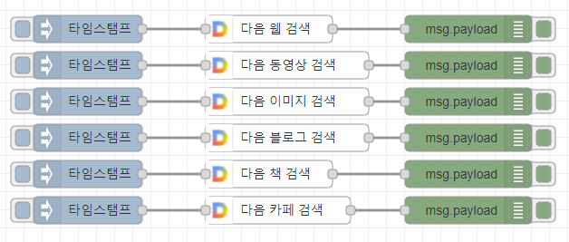

node-red-contrib-daumsearch
================

Node-RED node for daumsearch


## Install

To install the stable version use the `Menu - Manage palette - Install`
option and search for node-red-contrib-daumsearch, or run the following
command in your Node-RED user directory, typically `~/.node-red`

    npm install node-red-contrib-daumsearch

## Wrapper daum search  API  
- docs : https://developers.kakao.com/docs/latest/ko/daum-search/dev-guide#search-doc
- key : https://developers.kakao.com/console

## Sample parameters
```js


msg.params = {};
msg.params.api = 'blog'; //# API : web,vclip,image,blog,book,cafe 
msg.params.query = '테슬라'; //# 검색어
msg.params.size = "10" // # 출력 검색 수
msg.params.sort = 'date' //# 정렬 방식, accuracy(정확도순) 또는 recency(최신순), 기본 값 accuracy
msg.params.page = "1" //# 출력 페이지

return msg;

```

## Sample Flow
You can make this json string into a flow by using the node-red flow import function.

- [sample.json](examples/sample.json)



